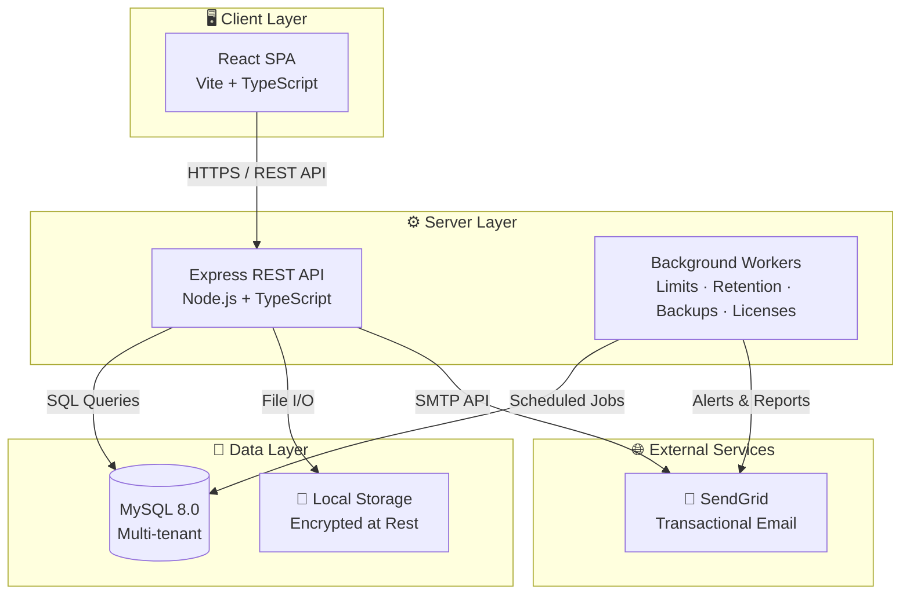
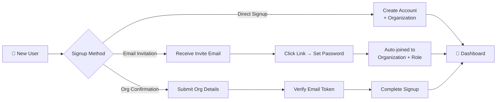
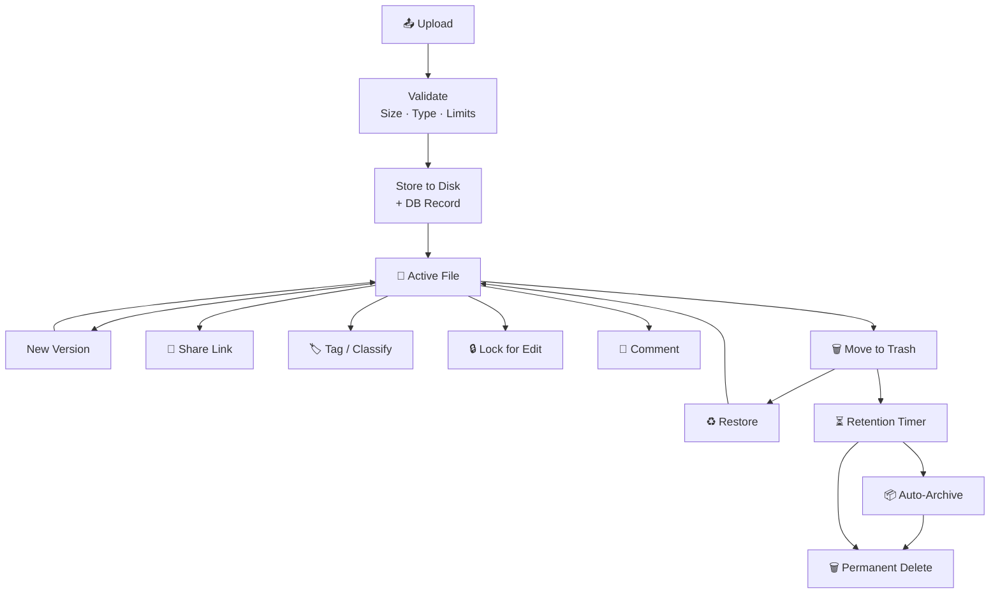
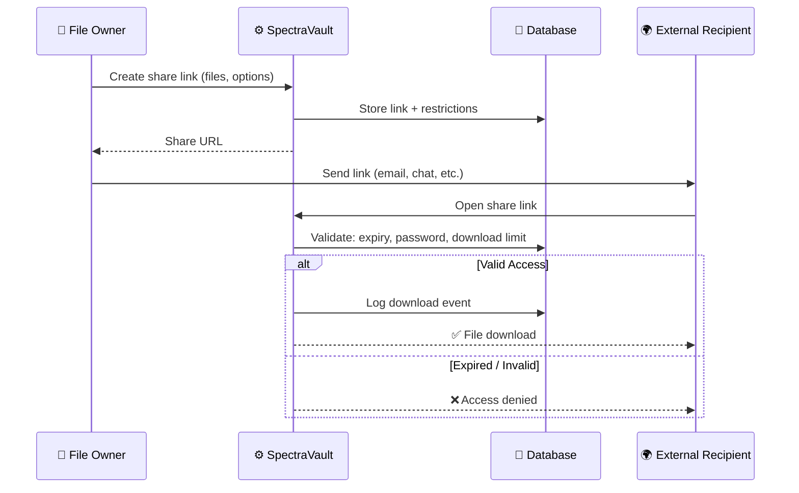
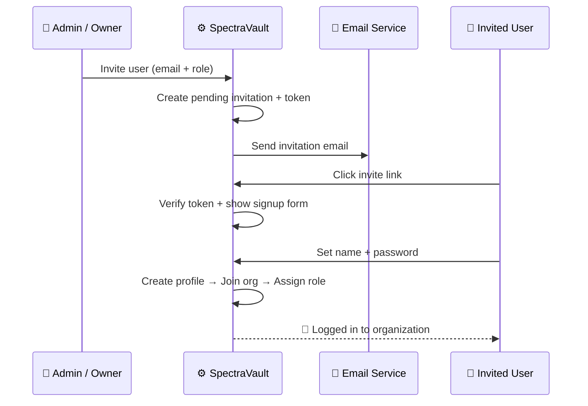
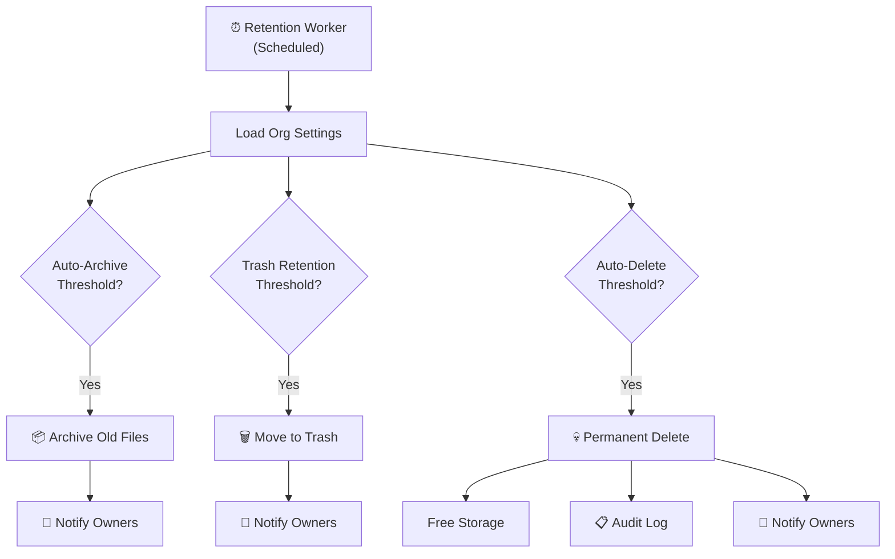

<h1 align="center">SpectraVault</h1>

  <strong>Enterprise-grade secure document management — built for teams that take data seriously.</strong>

  <a href="#-key-features">Features</a> •
  <a href="#-architecture">Architecture</a> •
  <a href="#-how-it-works">How It Works</a> •
  <a href="#-security--compliance">Security</a> •
  <a href="#-admin-console">Admin Console</a> •
  <a href="#-tech-stack">Tech Stack</a>

---

## 📑 Table of Contents

- [Overview](#-overview)
- [Key Features](#-key-features)
  - [Document Management](#-document-management)
  - [Collaboration & Sharing](#-collaboration--sharing)
  - [Team & Organization Management](#-team--organization-management)
  - [Presentations & Media](#-presentations--media)
  - [Analytics & Insights](#-analytics--insights)
  - [Notifications & Activity](#-notifications--activity)
- [Architecture](#-architecture)
- [How It Works](#-how-it-works)
  - [User Onboarding Journey](#user-onboarding-journey)
  - [Document Lifecycle](#document-lifecycle)
  - [Secure Sharing Flow](#secure-sharing-flow)
  - [Invitation & Team Growth](#invitation--team-growth)
  - [Data Retention & Compliance](#data-retention--compliance)
- [Security & Compliance](#-security--compliance)
- [Admin Console](#-admin-console)
- [Background Operations](#-background-operations)
- [Tech Stack](#-tech-stack)
- [Getting Started](#-getting-started)

---

## 🌟 Overview

**SpectraVault** is a self-hosted, multi-tenant document management platform designed for organizations that need full control over their data. Upload, organize, version, share, and audit every document — all within a secure, role-based environment.

Whether you're a small team or a large enterprise, SpectraVault gives you:

- 🔒 **End-to-end security** with encryption at rest, MFA, and granular permissions
- 👥 **Multi-organization** support with per-tenant isolation
- 📄 **Full document lifecycle** — upload, version, tag, archive, trash, and permanent delete
- 🔗 **Controlled sharing** with password protection, expiry dates, and download limits
- 📊 **Real-time analytics** and comprehensive audit trails
- 🛡️ **GDPR-ready** with data export and automatic data retention policies

---

## 🚀 Key Features

### 📁 Document Management

| Feature | Description |
|---------|-------------|
| **Upload & Organize** | Drag-and-drop single or multi-file uploads into a folder hierarchy |
| **File Versioning** | Automatic version history with restore, compare, and version notes |
| **Archive Import** | Import `.zip`, `.rar`, `.7z`, `.tar.gz` archives — extract contents or keep as-is |
| **Smart Views** | Switch between list and grid views; customize visible columns with drag-and-drop ordering |
| **Tags & Classification** | Organize files with custom tags and classify as Public, Internal, Confidential, or PII |
| **Bulk Operations** | Select multiple files for batch download, move, tag, trash, or delete |
| **Trash & Recovery** | Soft-delete with restore capability; configurable retention before permanent deletion |
| **File Locking** | Lock files during editing to prevent conflicts |
| **Image Compression** | Optional client-side image compression before upload |
| **Video Transcoding** | Server-side video transcode after upload for optimized playback |
| **Favorites** | Star important files for quick access |
| **Advanced Search** | Filter files by name, type, tags, date, and more |
| **Pagination** | Configurable page sizes with persisted user preferences |

### 🔗 Collaboration & Sharing

| Feature | Description |
|---------|-------------|
| **Share Links** | Generate secure links for single or multiple files |
| **Access Controls** | Password protection, expiry dates, and download limits per link |
| **Download Tracking** | Monitor who downloaded what and when |
| **File Comments** | Add comments to files for team discussion |
| **External Sharing** | Share with external recipients — no account required |
| **Organization Policies** | Enforce sharing rules at the organization level |

### 👥 Team & Organization Management

| Feature | Description |
|---------|-------------|
| **Role-Based Access** | Built-in roles (Owner, Admin, Member) plus fully custom roles with granular permissions |
| **User Groups** | Create groups and assign file/folder permissions at the group level |
| **Team Invitations** | Invite members by email with automatic role assignment |
| **Member Status** | Activate/deactivate members; control MFA enforcement per user |
| **Folder & File ACLs** | Restrict visibility of folders and files to specific roles, users, or groups |
| **Organization Settings** | Per-org configuration for storage limits, retention, sharing policies, and alerts |

### 🎬 Presentations & Media

| Feature | Description |
|---------|-------------|
| **File Presentations** | Turn documents into shareable presentations |
| **Engagement Tracking** | Track views, plays, likes, dislikes, and comments per presentation |
| **Album Support** | Group images into albums with individual reaction tracking |
| **Poll Integration** | Embed polls with questions, options, and real-time response collection |
| **Statistics** | Detailed analytics per presentation |

### 📊 Analytics & Insights

| Feature | Description |
|---------|-------------|
| **Dashboard** | At-a-glance overview of organization activity and storage usage |
| **Activity Heatmap** | Visual heatmap of team activity over time |
| **Download Analytics** | Track download patterns across files and shared links |
| **Storage Breakdown** | Detailed view of storage consumption by file type |
| **Audit Logs** | Comprehensive, searchable audit trail for every user and system action |

### 🔔 Notifications & Activity

| Feature | Description |
|---------|-------------|
| **In-App Notifications** | Real-time notifications for file events, shares, comments, and system alerts |
| **Email Notifications** | Configurable email alerts for key events (uploads, shares, limit warnings) |
| **Threshold Alerts** | Automatic warnings when storage, users, or files approach configured limits |
| **Activity Feed** | Chronological feed of all organization activity |

---

## 🏗️ Architecture

### Multi-Tenant Data Isolation

Every organization operates in its own logical partition. Files, folders, settings, roles, audit logs, and all metadata are scoped to the organization. Platform admins can oversee all tenants from a centralized console without crossing data boundaries.

---

## 🔄 How It Works

### User Onboarding Journey

### Document Lifecycle

### Secure Sharing Flow

### Invitation & Team Growth

### Data Retention & Compliance

---

## 🛡️ Security & Compliance

| Capability | Details |
|------------|---------|
| **Authentication** | Email + password with cookie-based sessions and JWT refresh token rotation |
| **Multi-Factor Auth** | Email-based MFA for both users and platform admins |
| **Encryption at Rest** | AES encryption with automatic key rotation and key versioning |
| **Role-Based Access Control** | System roles + fully custom roles with 20+ granular permissions |
| **Audit Logging** | Every action logged — file operations, auth events, admin actions, sharing |
| **Session Management** | View active sessions, force logout, token revocation |
| **GDPR Data Export** | One-click "Download Your Data" for organization owners — complete JSON export |
| **Data Retention Policies** | Configurable auto-archive, auto-trash, and auto-delete timelines per organization |
| **Inactivity Enforcement** | Automatic organization deletion after prolonged inactivity with data export |
| **Admin Impersonation** | Platform admins can impersonate org users with full audit trail and expiry controls |
| **File Classification** | Mark files as Public, Internal, Confidential, or PII for compliance workflows |

---

## ⚡ Admin Console

The **Super Admin Console** (`/admin`) provides centralized platform management:

| Module | Capabilities |
|--------|-------------|
| **Dashboard** | System health monitoring (CPU, RAM, disk, database, process), organization stats |
| **Organizations** | View, edit, activate/deactivate, manage licenses, impersonate users |
| **Users** | Browse all users across organizations, toggle admin status, view activity |
| **Files** | Platform-wide file overview and storage analytics |
| **Audit Logs** | Search and filter all system and tenant audit events |
| **Email Templates** | Live preview and customize all transactional emails (dark/light themes) |
| **Platform Settings** | Configure security policies, storage defaults, email settings, plan limits |
| **Maintenance Mode** | Enable maintenance windows with user-facing messages |
| **App Versions** | Track and manage application releases |
| **License Management** | Set license types, expiry dates, and plan-based feature limits per organization |

---

## 🔧 Background Operations

SpectraVault runs several automated workers to keep the platform healthy and compliant:

| Worker | Schedule | Purpose |
|--------|----------|---------|
| **Limit Alert Worker** | Periodic | Evaluates storage/user/file usage against thresholds and sends warnings |
| **Retention Worker** | Periodic | Enforces auto-archive, auto-trash, and auto-delete retention policies |
| **Backup Worker** | Configurable | Automated database dumps, compression, retention cleanup, and email reports |
| **License Check Worker** | Periodic | Detects expiring/expired licenses, sends notifications, deactivates orgs |
| **Inactivity Worker** | Hourly | Warns and eventually deletes organizations with prolonged inactivity |
| **Export Cleanup** | With inactivity worker | Removes expired GDPR data export files after 30-day TTL |
| **NPM Audit** | Configurable | Scans frontend and backend dependencies for vulnerabilities |

---

## 🛠️ Tech Stack

| Layer | Technology |
|-------|------------|
| **Frontend** | React 18 · Vite · TypeScript · Tailwind CSS · Shadcn/UI · Radix Primitives |
| **Backend** | Node.js · Express · TypeScript |
| **Database** | MySQL 8.0 (InnoDB) |
| **Email** | SendGrid with Handlebars templates and CID-embedded branding |
| **Storage** | Local filesystem with bucket-based organization and encryption at rest |
| **Auth** | JWT + HTTP-only cookies · Refresh token rotation · MFA |
| **Charts** | Recharts for analytics and dashboard visualizations |
| **Animations** | Framer Motion for UI transitions |

---

  Built with ❤️ by the SpectraEYE Team

